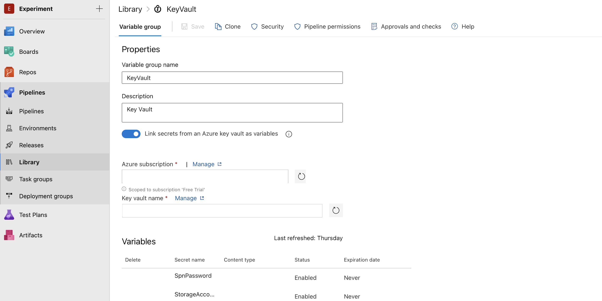
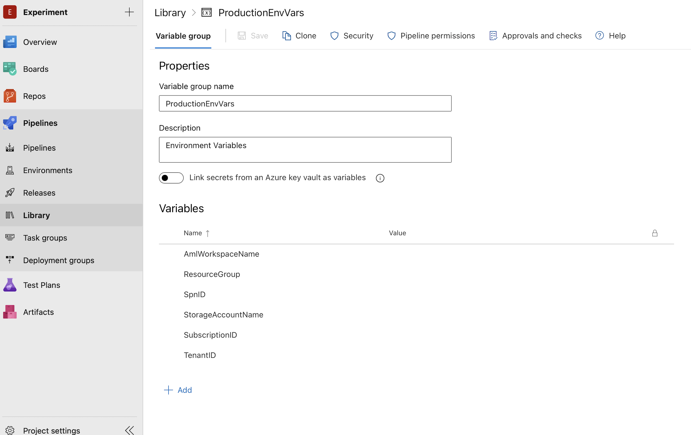
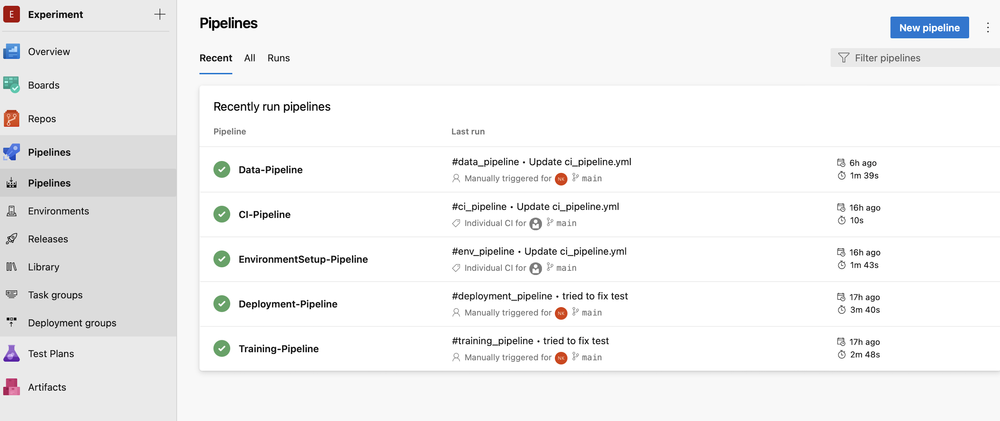

# Mlops
Mlops with Azure *

## Set Up Resources*
1. Create a resource*
az group create --name <resource-group> --location <location> *

2. Create ML Workspace *
az ml workspace create -w <workspace-name> -g <resource-group> *

3. Create Azure account and define the SKU *
az storage account create --name <storage-account-name> \ *
    --resource-group <resource-group> \ *
    --location <location> \ *
    --sku Standard_ZRS \ *
    --encryption-services blob *

4. Get the kwy for this storage account *
az storage account keys list --account-name <storage-account-name> --resource-group <resource-group> *

5. Create Service Principal with password authentication *
az ad sp create-for-rbac --name <spn-name> *

6. Create an Azure KeyVault *
az keyvault create --name <keyvault-name> \ *
    --resource-group <resource-group> \ *
    --location <location> *

6. Store Secret Key in Azure Key Vault *
az keyvault secret set --vault-name <keyvault-name> --name "StorageAccountKey" --value <storage-account-key> *
az keyvault secret set --vault-name <keyvault-name> --name "SpnPassword" --value <service-principle-password> *

7. Give Service Principle Access to key vault *
az keyvault set-policy -n <keyvault-name> \ *
    --spn <service-principle-app-id> \ *
    --secret-permissions get list set delete \ *
    --key-permissions create decrypt delete encrypt get list unwrapKey wrapKey *

8. az account show *

## Set up keys and password in Azure Devops Organization
1. Add keyVault to your library as below *

2. Add ProductionEnvironmentVariables to your libarary as below *

## Project Folder Structure
MLOPS *
    -src *
        -my_custom_package *
            -scripts *
                -call_web_service.py *
            -test *
                -testdata/ *
                -test_aml_interface.py *
                -test_blob_storage_interface.py *
                -test_create_aml_env.py *
                -test_create_aml_experiment.py *
                -test_create_data.py *
                -test_deploy.py *
                -test_deploy_aml_model.py *
                -test_score.py *
                -test_transform_data.py *
            -utils *
                -aml_interface.py *
                -blob_storage_interface.py *
                -const.py *
                -transform_data.py *
            -create_aml_env.py *
            -create_aml_experiment.py *
            -create_data.py *
            -deploy_aml_data.py *
            -cscore.py *
            -train.py *
        -setup.py *
    -ci_pipeline.yml *
    -data_pipeline.yml *
    -deploy_pipeline.yml *
    -env_pipeline.yml *
    -train_pipeline.yml *
    -requirements.txt *

### !!! Hurray !!!!  
 *